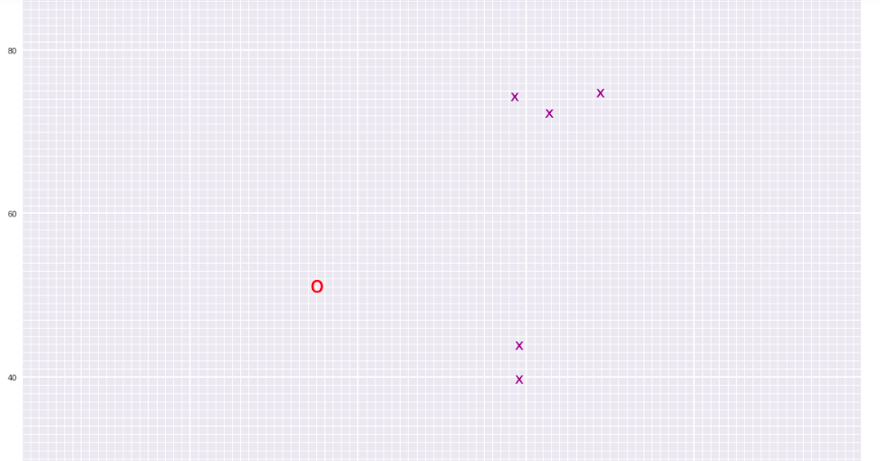
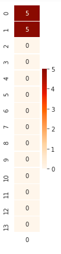

# Landmark Detection & Robot Tracking (SLAM)

## Project Overview

In this project, I have implemented SLAM (Simultaneous Localization and Mapping) for a 2 dimensional world! I have combined the knowledge of robot sensor measurements and movement to create a map of an environment from only sensor and motion data gathered by a robot, over time. SLAM gives a way to track the location of a robot in the world in real-time and identify the locations of landmarks such as buildings, trees, rocks, and other world features. This is an active area of research in the fields of robotics and autonomous systems. 

*Below is an example of a 2D robot world with landmarks (purple x's) and the robot (a red 'o') located and found using *only* sensor and motion data collected by that robot. This is just one example for a 50x50 grid world; in your work you will likely generate a variety of these maps.*

<p align="center">
  
</p>

__Notebook 1__ : Robot Moving and Sensing

__Notebook 2__ : Omega and Xi, Constraints 

__Notebook 3__ : Landmark Detection and Tracking 


## Project Instructions

All of the starting code and resources you'll need to compete this project are in this Github repository. Before you can get started coding, you'll have to make sure that you have all the libraries and dependencies required to support this project. If you have already created a `cv-nd` environment for [exercise code](https://github.com/udacity/CVND_Exercises), then you can use that environment! If not, instructions for creation and activation are below.

### Local Environment Instructions

1. Clone the repository
```
https://github.com/Apucs/Landmark-Detection-and-Robot-Tracking.git
```

2. __Requirements for this project___
```
pip install -r requirements.txt
```

## __Inference__
> Initial __Omega__ matrix
<p align="center">
  
</p>

> Initial __Xi__ matrix
<p align="center">
  
</p>

> __Robot world__
<p align="center">
  
</p>


LICENSE: This project is licensed under the terms of the MIT license.
